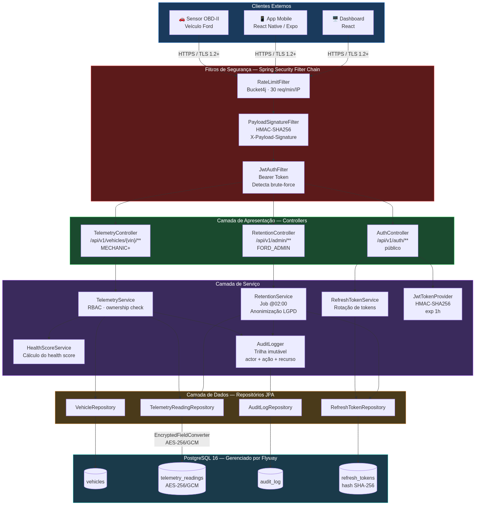

# HENRY Telemetry Service

**HENRY — Holistic Engagement Navigator for Retention & Yield**

Microsserviço de telemetria da plataforma HENRY (Projeto Ford ZeroTouch). Recebe dados OBD-II de veículos Ford, calcula o **health score** e fornece a base de dados para o assistente HENRY engajar proativamente os clientes com manutenções preventivas — aumentando o VIN Share da rede oficial Ford.

---

## Arquitetura de Componentes



O diagrama acima mostra as cinco camadas do serviço:

| Camada | Responsabilidade |
|---|---|
| **Clientes externos** | App mobile (Expo), Dashboard (React), sensores OBD-II do veículo |
| **Filtros de segurança** | RateLimitFilter → PayloadSignatureFilter → JwtAuthFilter (nessa ordem) |
| **Controllers** | Roteamento HTTP + RBAC declarativo por endpoint |
| **Services** | Lógica de negócio isolada, auditoria e retenção |
| **Repositórios / BD** | JPA + Flyway + PostgreSQL com campos sensíveis cifrados |

---

## Stack

| Camada | Tecnologia |
|---|---|
| Framework | Spring Boot 3.2 + Java 21 |
| Banco de Dados | PostgreSQL 16 |
| Migrations | Flyway |
| Documentação | SpringDoc OpenAPI (Swagger UI) |
| Autenticação | JWT (HMAC-SHA256) via jjwt |
| Rate Limiting | Bucket4j |
| Logs | Logback + Logstash JSON encoder |

---

## Como rodar

### Pré-requisitos
- Java 21
- Maven 3.9+
- PostgreSQL rodando localmente

### 1. Criar banco de dados

```sql
CREATE DATABASE henry_telemetry;
CREATE USER henry WITH PASSWORD 'henry123';
GRANT ALL PRIVILEGES ON DATABASE henry_telemetry TO henry;
```

### 2. Rodar a aplicação

```bash
mvn spring-boot:run
```

Flyway executa as migrations automaticamente na inicialização.

### 3. Acessar Swagger UI

```
https://localhost:8443/swagger-ui.html
```

> O serviço roda com HTTPS/TLS 1.2+ na porta **8443**. Ao abrir no browser, aceite o certificado auto-assinado (`keystore.p12`) em ambiente de desenvolvimento.

---

## Endpoints

| Método | Path | Role mínima | Descrição |
|---|---|---|---|
| POST | `/api/v1/auth/token` | público | Gera token JWT para testes |
| POST | `/api/v1/vehicles/{vin}/readings` | MECHANIC | Registra nova leitura OBD-II |
| GET | `/api/v1/vehicles/{vin}/readings` | CUSTOMER | Lista histórico de leituras |
| GET | `/api/v1/vehicles/{vin}/health-score` | CUSTOMER | Retorna health score atual (usado pelo HENRY) |
| PATCH | `/api/v1/vehicles/{vin}/readings/{id}` | MECHANIC | Marca leitura como processada |
| DELETE | `/api/v1/vehicles/{vin}/readings/{id}` | FORD_ADMIN | Remove uma leitura |

---

## Segurança implementada

| Critério | Implementação | Critério PDF |
|---|---|---|
| Validação de entrada + regex VIN + faixas numéricas | Bean Validation em todos os DTOs | Seg. Entrada 20pts |
| SQL Injection | Spring Data JPA (queries parametrizadas — ORM) | Seg. Entrada 20pts |
| Limitação de payload | `spring.servlet.multipart.max-request-size=1MB` + Tomcat config | Seg. Entrada 20pts |
| Tratamento seguro de erros | `GlobalExceptionHandler` — sem stack trace, sem tech disclosure | Seg. Entrada 20pts |
| HTTPS/TLS 1.2+ | `keystore.p12` + SSL habilitado em `application.yml` (porta 8443) | Proteção API 20pts |
| Autenticação JWT | HMAC-SHA256, expiração 1h, assinatura forte | Auth 20pts |
| Refresh token com rotação | Persistido como hash SHA-256, rotacionado a cada uso, revogável | Auth 20pts |
| RBAC 4 roles | CUSTOMER / MECHANIC / DEALER_MANAGER / FORD_ADMIN | Auth 20pts |
| Rate limiting | Bucket4j — 30 req/min por IP com token bucket | Proteção API 20pts |
| CORS | Origins explícitas — sem wildcard | Proteção API 20pts |
| Assinatura de payload | `PayloadSignatureFilter` — HMAC-SHA256 via header `X-Payload-Signature` | Proteção API 20pts |
| Criptografia em repouso | AES-256/GCM via `EncryptedFieldConverter` — IV aleatório por registro (NIST SP 800-38D) | Privacidade 25pts |
| Anonimização/retenção | `RetentionService` — job diário às 02:00 + endpoint manual | Privacidade 25pts |
| Descarte de tokens expirados | `RefreshTokenRepository.deleteExpiredAndRevoked()` | Privacidade 25pts |
| Proteção contra exposição acidental | Sem dados sensíveis em logs; errors genéricos; endpoints documentados | Privacidade 25pts |
| Logs estruturados JSON | Logback + Logstash encoder em prod (sem dados sensíveis) | Monitoramento 15pts |
| Monitoramento de eventos suspeitos | `JwtAuthFilter` conta falhas por IP — alerta acima do threshold | Monitoramento 15pts |
| Trilha de auditoria | `AuditLogger` — actor, ação, recurso em toda operação sensível | Monitoramento 15pts |

## Endpoints de autenticação

| Método | Path | Descrição |
|---|---|---|
| POST | `/api/v1/auth/token` | Gera access token + refresh token |
| POST | `/api/v1/auth/refresh` | Renova access token (rotaciona refresh) |
| POST | `/api/v1/auth/logout` | Revoga todos os refresh tokens do usuário |

## Como usar a assinatura de payload

Para endpoints POST/PATCH, incluir o header:
```
X-Payload-Signature: <HMAC-SHA256-Base64 do body>
```

Exemplo em Python:
```python
import hmac, hashlib, base64, json
body = json.dumps({"vin": "...", "engineTempCelsius": 92.0, ...})
secret = "henry-payload-hmac-secret-ford-2026"
sig = base64.b64encode(hmac.new(secret.encode(), body.encode(), hashlib.sha256).digest()).decode()
headers = {"X-Payload-Signature": sig}
```

---

## Contexto do Projeto

Este serviço é parte do **Ford ZeroTouch**, solução desenvolvida para o Challenge Ford FIAP 2026 (Desafio 2 — VIN Share na América do Sul).

O fluxo completo: veículo OBD-II → MQTT → **telemetry-service** → health score → HENRY AI → agendamento proativo → check-in automático → rastreamento em tempo real → NPS via chat.

Disciplinas cobertas por esta entrega: **SOA (Arquitetura Orientada a Serviços)** + **Cybersecurity**.

---

## Notas de Segurança Adicionais

### Gestão de segredos

Os valores de `security.jwt.secret`, `security.encryption.key` e `security.payload-signature.secret` estão definidos diretamente no `application.yml` para facilitar a execução local. Em ambiente de produção esses valores devem ser injetados via **variáveis de ambiente** ou um cofre de segredos (ex: HashiCorp Vault, AWS Secrets Manager):

```bash
export SECURITY_JWT_SECRET=<valor-gerado>
export SECURITY_ENCRYPTION_KEY=<32-chars>
export SECURITY_PAYLOAD_SIGNATURE_SECRET=<valor-gerado>
```

### Proteção contra XSS

Esta API retorna exclusivamente `application/json` — não renderiza HTML em nenhum endpoint. Por design, a superfície de ataque de Cross-Site Scripting (XSS) é eliminada: sem template engine, sem interpolação de dados em HTML. A validação Bean Validation (`@Pattern`, `@Size`) nas entradas reforça esse isolamento.
